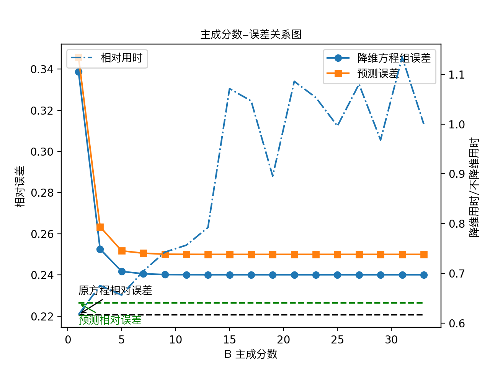
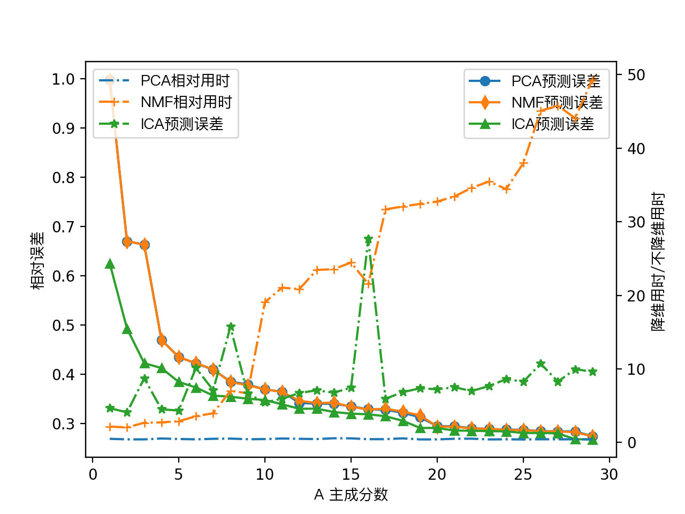

# 通过 PCA 解大型超定线性方程组及在工业上的应用

宋丛威

（浙江工业大学之江学院 理学院 绍兴 312030）

**摘要**

本文用主成分分析 (PCA) 降维技术解大型超定线性方程组 $AX=B$ 最小二乘解. 工业上遇到的大型方程组的求解要消耗大量的时间和内存, 而且不够经济. 此外系数矩阵通常是病态的, 会带来不可忽视的误差. 本文设计出基于PCA的算法, 并从理论上说明它的可行性. 实验证明本文的方法很有效, 不仅测试误差极小, 接近原方程的误差, 而且计算时间可以显著减少. 


**关键字**：PCA, SVD, 线性方程组, 最小二乘解

**中图分类号**：TP301.6


# Solving Large-scale Over-determined Linear Equations via PCA and the Application in Industry

Congwei Song

（Zhijiang College of Zhejiang University of Technology, Science Department, Shaoxing 312030）

**Abstract**

In the paper, we find Least-squares solution large-scale over-determined linear equations $AX=B$ via the  of dimensional reduction technology of Principal Component Analysis (PCA). Solving the large equations in industry consume massive time and memory, that is not economical. Moreover, the coeffecient matrix is usually ill and will cause innegligible error. We design an alogrithm based on PCA, and validate its feasibility in theory. The experiments show that the method proposed in the paper is very effective, only the test error is small, approach to the error of original equations, while the computing time is reduced significantly. 


**Keywords**：PCA, SVD, Linear Equations,  Least-squares solution


## 背景

印染行业通常要面临下述问题：从多个布匹的染色流程中, 获取染色光谱数据, 估计使用染料的光谱数据

设

$A_{ij}$: 流程$i$ 染料 $j$ 用量（百分比）

$X_{jk}$: 染料 $j​$ 色谱

$B_{ik}​$: 流程$i​$色谱 

三个量具有线性关系$B_{ik}=\sum_jA_{ij}X_{jk}$, 即 $AX=B$ 

遇到的难题：使用多种染料, 获取了大量光谱数据. 方程数量非常大, 我们的策略是用机器学习的降维方法来缩小矩阵大小. 


本文只用了5000多组数据, 而这只是工业数据中极小的一部分. 目的在于充分验证本文提出的方法的有效性. 


部分数据, LS: 光谱, D:染料

| LS360 | LS370  | LS380  | LS390  | LS400  | LS410  | LS420  | LS430  | LS440  | LS450 | LS460  | LS470  | LS480  | LS490  | LS500  | LS510  | LS520  | LS530  | LS540 | LS550  | LS560  | LS570  | LS580  | LS590  | LS600  | LS610  | LS620  | LS630  | LS640  | LS650  | LS660  | LS670  | LS680  | LS690  | LS700  | D31  | D32  | D33  | D58  | D100 | D107 | D110 | D120 | D128 | D150 | D160 | D161 | D162 | D170 | D180 | D200 | D202 | D210 | D220 | D221 | D260 | D300 | D301 | D302 | D303 | D304 | D306 | D307 | D308  | D310 | D311 | D312 | D314   | D316 | D317 | D318   | D320 | D321 | D324 | D326 | D327 | D328  | D350 | D351 | D355 | D357 | D358 | D359 | D360 | D361 | D362 | D363 | D366 | D367 | D368 | D370 | D372 | D376 | D377 | D378 | D380 | D500 | D501 | D503 | D504 | D506  | D508 | D510 | D511 | D514  | D516   | D520 | D524 | D526  | D527 | D530 | D551 | D555 | D560 | D561 | D565 | D570 | D575 | D576 | D580 | D581 | D980 |
| ----- | ------ | ------ | ------ | ------ | ------ | ------ | ------ | ------ | ----- | ------ | ------ | ------ | ------ | ------ | ------ | ------ | ------ | ----- | ------ | ------ | ------ | ------ | ------ | ------ | ------ | ------ | ------ | ------ | ------ | ------ | ------ | ------ | ------ | ------ | ---- | ---- | ---- | ---- | ---- | ---- | ---- | ---- | ---- | ---- | ---- | ---- | ---- | ---- | ---- | ---- | ---- | ---- | ---- | ---- | ---- | ---- | ---- | ---- | ---- | ---- | ---- | ---- | ----- | ---- | ---- | ---- | ------ | ---- | ---- | ------ | ---- | ---- | ---- | ---- | ---- | ----- | ---- | ---- | ---- | ---- | ---- | ---- | ---- | ---- | ---- | ---- | ---- | ---- | ---- | ---- | ---- | ---- | ---- | ---- | ---- | ---- | ---- | ---- | ---- | ----- | ---- | ---- | ---- | ----- | ------ | ---- | ---- | ----- | ---- | ---- | ---- | ---- | ---- | ---- | ---- | ---- | ---- | ---- | ---- | ---- | ---- |
| 22.75 | 24.37  | 24.245 | 23.675 | 23.168 | 22.685 | 22.405 | 22.227 | 22.112 | 22.28 | 22.685 | 23.117 | 23.411 | 23.714 | 23.991 | 24.008 | 23.755 | 23.496 | 23.05 | 22.154 | 21.587 | 21.714 | 22.202 | 22.426 | 22.568 | 22.605 | 22.635 | 22.897 | 23.641 | 25.373 | 27.8   | 32.377 | 40.826 | 46.162 | 54.032 | 0    | 0    | 0    | 0    | 0    | 0    | 0    | 0    | 0    | 0    | 0    | 0    | 0    | 0    | 0    | 0    | 0    | 0    | 0    | 0    | 0    | 0    | 0    | 0    | 0    | 0    | 0    | 0    | 0.058 | 0    | 0    | 0    | 0      | 0    | 0    | 0.0112 | 0    | 0    | 0    | 0    | 0    | 0.018 | 0    | 0    | 0    | 0    | 0    | 0    | 0    | 0    | 0    | 0    | 0    | 0    | 0    | 0    | 0    | 0    | 0    | 0    | 0    | 0    | 0    | 0    | 0    | 0.21  | 0    | 0    | 0    | 0     | 0.0615 | 0    | 0    | 0.172 | 0    | 0    | 0    | 0    | 0    | 0    | 0    | 0    | 0    | 0    | 0    | 0    | 0    |
| 22.75 | 24.37  | 24.245 | 23.675 | 23.168 | 22.685 | 22.405 | 22.227 | 22.112 | 22.28 | 22.685 | 23.117 | 23.411 | 23.714 | 23.991 | 24.008 | 23.755 | 23.496 | 23.05 | 22.154 | 21.587 | 21.714 | 22.202 | 22.426 | 22.568 | 22.605 | 22.635 | 22.897 | 23.641 | 25.373 | 27.8   | 32.377 | 40.826 | 46.162 | 54.032 | 0    | 0    | 0    | 0    | 0    | 0    | 0    | 0    | 0    | 0    | 0    | 0    | 0    | 0    | 0    | 0    | 0    | 0    | 0    | 0    | 0    | 0    | 0    | 0    | 0    | 0    | 0    | 0    | 0.058 | 0    | 0    | 0    | 0      | 0    | 0    | 0.0112 | 0    | 0    | 0    | 0    | 0    | 0.018 | 0    | 0    | 0    | 0    | 0    | 0    | 0    | 0    | 0    | 0    | 0    | 0    | 0    | 0    | 0    | 0    | 0    | 0    | 0    | 0    | 0    | 0    | 0    | 0.215 | 0    | 0    | 0    | 0     | 0.0645 | 0    | 0    | 0.178 | 0    | 0    | 0    | 0    | 0    | 0    | 0    | 0    | 0    | 0    | 0    | 0    | 0    |
| 9.657 | 10.268 | 9.281  | 7.871  | 6.922  | 6.207  | 5.856  | 5.668  | 5.589  | 5.634 | 5.783  | 5.978  | 6.185  | 6.452  | 6.775  | 7.034  | 7.25   | 7.402  | 7.46  | 7.46   | 7.468  | 7.485  | 7.554  | 7.568  | 7.569  | 7.53   | 7.545  | 7.764  | 8.436  | 9.907  | 12.013 | 16.019 | 24.348 | 29.657 | 37.745 | 0    | 0    | 0    | 0    | 0    | 0    | 0    | 0    | 0    | 0    | 0    | 0    | 0    | 0    | 0    | 0    | 0    | 0    | 0    | 0    | 0    | 0    | 0    | 0    | 0    | 0.24 | 0    | 0    | 0     | 0    | 0    | 0    | 0.0228 | 0    | 0    | 0      | 0    | 0    | 0.28 | 0    | 0    | 0     | 0    | 0    | 0    | 0    | 0    | 0    | 0    | 0    | 0    | 0    | 0    | 0    | 0    | 0    | 0    | 0    | 0    | 0    | 0    | 0    | 0    | 0    | 0.64 | 0     | 0    | 0    | 0    | 0.19  | 0      | 0    | 0.7  | 0     | 0    | 0    | 0    | 0    | 0    | 0    | 0    | 0    | 0    | 0    | 0    | 0    | 0    |
| 3.949 | 3.631  | 3.312  | 3.122  | 3.054  | 3.007  | 3.012  | 3.018  | 3.031  | 3.083 | 3.192  | 3.311  | 3.427  | 3.571  | 3.697  | 3.717  | 3.64   | 3.514  | 3.304 | 3.08   | 2.904  | 2.801  | 2.797  | 2.826  | 2.888  | 2.964  | 3.06   | 3.259  | 3.596  | 4.226  | 5.152  | 7.166  | 12.467 | 17.012 | 24.113 | 0    | 0    | 0    | 0    | 0    | 0    | 0    | 0    | 0    | 0    | 0    | 0    | 0    | 0    | 0    | 0    | 0    | 0    | 0    | 0    | 0    | 0    | 0    | 0    | 0    | 0.47 | 0    | 0    | 0     | 0    | 0    | 0    | 0.012  | 0    | 0    | 0      | 0    | 0    | 0.37 | 0    | 0    | 0     | 0    | 0    | 0    | 0    | 0    | 0    | 0    | 0    | 0    | 0    | 0    | 0    | 0    | 0    | 0    | 0    | 0    | 0    | 0    | 0    | 0    | 0    | 1.15 | 0     | 0    | 0    | 0    | 0.285 | 0      | 0    | 0.85 | 0     | 0    | 0    | 0    | 0    | 0    | 0    | 0    | 0    | 0    | 0    | 0    | 0    | 0    |
| 1.883 | 1.861  | 1.801  | 1.781  | 1.742  | 1.695  | 1.689  | 1.677  | 1.659  | 1.641 | 1.631  | 1.62   | 1.604  | 1.595  | 1.576  | 1.545  | 1.553  | 1.553  | 1.566 | 1.575  | 1.564  | 1.528  | 1.539  | 1.537  | 1.552  | 1.571  | 1.601  | 1.637  | 1.679  | 1.755  | 1.934  | 2.168  | 4.147  | 6.809  | 11.224 | 0    | 0    | 0    | 0    | 0    | 0    | 0    | 0    | 0    | 0    | 0    | 0    | 0    | 0    | 0.1  | 0    | 0    | 0    | 0    | 0    | 0    | 0    | 0    | 0    | 0    | 0    | 0    | 0    | 0     | 0    | 0    | 0    | 0      | 0    | 0    | 0      | 0    | 0    | 0    | 0    | 0    | 0     | 0    | 0    | 0    | 0    | 0    | 0    | 0    | 0    | 0    | 0    | 0    | 0    | 0    | 0    | 0    | 0    | 0    | 0    | 1.2  | 0    | 0    | 0    | 0    | 0     | 0    | 0    | 0    | 0.8   | 0      | 0    | 0.62 | 0     | 0    | 0    | 0    | 0    | 0    | 0    | 0    | 0    | 0    | 0    | 5.3  | 0    | 0    |


## 建模

解$AX=B$ , 优化问题 $\min_X \|AX-B\|_2 $

其中 $A:N\times r, X:r\times c, B:N\times c$, $r,N$ 很大；此外, $A^TA​$可能是病态的. 

由于各种原因, 原方程可能没有解, 只能寻求最小二乘解. 最小二乘解采用向量的2范数. 
$$
\|x\|_2 = \sqrt{\sum_ix_i^2}
$$
矩阵$X$, 看成列向量$X_j$的组合, $X$的范数也应该是$X_j$范数的组合, 即 Frobenius 范数
$$
\|X\|_F = \sqrt{\sum_i||X_j\|_2^2}= \sqrt{\sum_{ij}|x_j|^2}
$$
严格地说, 我们还要增加限制条件$X_{ij}\geq 0​$. 但是, 可以想象$X​$的负数元素的绝对值不会太大, 直接设置为0, 不会对解有显著影响. 如果不是数据采集有误差, 原方程组应该是有非负解的. 

### 记号说明

大写字母$A $代表矩阵, 其中的元素用对应的小写字母表示, 如$a_{ij}$; $A=[A_1,A_2]$ 表示分块矩阵; $A^T$表示矩阵转置; $A^+$表示$A$的广义逆, 不会被实际计算. $\lambda$表示矩阵特征值. 


## 算法设计

### 理论分析


为了避免多余的矩阵运算, 我们没有按照标准的PCA流程, 而是直接对$A^TA$进行奇异值分解（或特征值分解）, 最终得到：
$$
A=CV^T=UDV^T
$$
其中$V$是$A^TA$特征向量构成的矩阵, $C$是主成分矩阵, $D$主对角线包含$A$的奇异值（与$A$形状一致）.


下面我们论述如何选择主成分. 选择$C$中部分列向量$C_1$作为主成分, 对应地有$A_1=C_1V_1^T=UD_1V_1^T$. 问题转化成求解$A_1X-B$, 理论上可以得到最小二乘解$A_1^+B, A_1^+=V_1D^{+}_1U^T$, 其中$D^{+}_1$是对$D_1$是对非零元素求倒数并转置. 通过进一步的线性代数演算, 可以证明

$$
AX-B = AA_1^+B-B = U\Lambda U^TB
$$
其中对角矩阵$\Lambda​$满足
$$
\Lambda_{ii}=\begin{cases}0, i \text{选为主成分，且对应奇异值不为0}\\
-1, i \text{其余}
\end{cases}
$$
这么看, 似乎选择哪些主成分并不重要. 但是计算$A_1^+$时, $D_1$的元素太小, 可能会带来巨大的误差, 我们总希望除数越大越好. 这是选择对应奇异值绝对值（因此也对应于特征值）最大的主成分的真正原因. 


此外, PCA 可以控制方程病态性. 我们用$A^TA$的条件数最为方程病态性的指标, 大致为$\frac{\lambda_\max}{\lambda_\min}$, 其中$\lambda_\min$和$\lambda_\max$ 分别是$A^TA$的最小最大特征值. PCA 只选取特征值较大的几个分量, 因此分母变大, 条件数也就变小.


本文还会考虑对$B$降维, 显然应该选取对应特征值绝对值最大的主成分. 


### 算法

根据上述分析，我们设计如下算法.

1. 用PCA/SVD, 得到矩阵分解$A=CV^T$, 方程归约为解$CY=B, Y=V^TX$.

2. $C=[C_1, C_2], V=[V_1, V_2]$ （根据主成分分块）

   2.1. 解$C_1Y_1=B$, 得到$Y_1\sim C_1^+B$, （最小二乘法）

   2.2. 解$V^T_1X=Y_1​$, 得到$X\sim V_1Y_1​$

3. 令$\hat{X}= V_1Y_1$, 作为对$X$的估计, 计算误差$\|A\hat{X}-B\|_2$ (或用$\|C_1Y_1-B\|_2$代替)


按照机器学习的说法, 这是一个针对模型$AX=B$的训练过程, 模型的输入-输出样本为$A,B$, 通过训练得到参数估计$\hat{X}$（依然写成$X$）. 


**注** 算法没有按照标准的PCA流程, 而是直接对$A^TA$进行奇异值分解（或特征值分解）. 2.2不必使用最小二乘法；用NMF, 分解$A=WH$, 此时2.2要再应用一次最小二乘法. 


### 解的处理

我们称, 最后得到的$X=V_1Y_1$是原方程$AX=B$的降维（最小二乘）解. 为了满足非负性, 可简单修正为
$$
X_+=\max(X,0)​
$$


实际上, 为了方便计算, 我们也可以对$B$进行降维 (取前三个主成分). 此时方程变为 
$$
AXW=BW
$$

$BW$代表$B$的主成分矩阵, 我们只选用前面几个, 记为$BW_1$. 方程的解是$X_0=XW_1$, 不是$X$, 为了让$X$元素非负, 考虑下述处理
$$
\tilde{X}_0 = (X_0W_1^T)_+W_1
$$
但即便是这样操作, 也未必保证$X$非负, 只能保证$X_0 W_1^T$非负. 然而保证$X_0 W_1^T$非负其实并没有实际意义, 因为$X_0W_1^T$并不能完全重构出$X$. 因此, 当对$B$进行降维时, 我们并不建议对解做任何处理. 

数值实验表明“非负处理”对误差的影响非常微小. 


## 数值实验

本文的算法用 Python 实现, 运行于 MacOS 上. 所有源代码托管在[GitHub](<https://github.com/Freakwill/PCA-linear-equations>)上. 

### 主成分选择

本文打算对矩阵$A,B$降维, 通过观察累计百分比曲线, 选择适当的主成分数. 


### 误差分析

误差采用向量的2范数, 对矩阵来说就是, Frobenius 范数（上文已给出定义）. 我们最终用相对误差公式衡量算法逼近能力.
$$
\frac{\|AX-B\|_F}{\|B\|_F}
$$
当$B$降维后, 我们不再用 (9) 衡量误差, 而是
$$
\frac{\|AX_0W_1^T-B\|_F}{\|B\|_F}
$$
其中$X_0W_1^T$代表在$B$降维后对解的重构. 


20%的样本会被实现抽取出来, 用来测试. 测试误差通常比训练误差更有说服力.


1. 原方程组没有解, 图中原方程误差是理论上最小的（在没有限制的情况下）, 不妨看做一个相对0点. 如果降维方法的误差低于这个0点, 应认为是系统误差造成的, 不是数值分析意义上的误差. 
2. 降维方程组的误差衰减令人满意. “负数值置零”的处理, 对误差没有太大影响. 
3. 依然绘制出累计百分比, 用于和误差对照. 


下图是对$B​$取前4个主成分得到的误差图, 和之前的实验相比, 这样做并没有显著影响误差. 时间和主成分数基本上呈线性相关, 符合预期. 这说明降维算法非常有效. 


再来看一下, $B$的降维对解方程是否有明显影响. $A$取前30个主成分. 



1. 似乎$B$主成分数对误差影响没有$A$大, 可能是因为$B$维数较低, 且主成分比较集中, 在第一个主成分处, 误差已降到0.3左右. 

2. 用时与主成分数近似呈线性相关, 符合预期, $B​$的降维也提高了效率. 

    

因此, 对$B​$降维是合理的.

   

**注** 训练样本和测试样本是随机选取的, 各自的最小误差略有不同, 而且每次实验都会变动. 可以通过设定随机种子, 产生固定的一组训练-测试样本. 


选用$A$前30个主成分, $B$前4个主成分, 

    解 AX=B
    A: 4177 X 87
    B: 4177 X 35
    ------------
    A 主成分数: 30
    B 主成分数: 4
    降维训练误差: 0.2508 (用时 0.0108sec)
    测试误差: 0.2568
    原方程误差: 0.2226

### 说明

我们还采用NMF降维, 效果和PCA相近, 但矩阵分解后不得不解两组方程. PCA的优势在于能分解出正交矩阵, 简化求解, 计算用时短. 



无论是PCA还是NMF, 当主成分增加时, 都会出现负数解. 可以把所有负数处理成非负数. 数值实验表明主成分过多还有可能出现异常. 

## 总结

PCA降维在解大型线性方程组表现的非常出色, 随着主成分增加, 误差快速递减. 这种简单的代数学技巧, 不仅计算快, 算法设计简单. 可以根据需要任意压缩原方程为$C_1Y_1=B$. 和NMF等降维策略比, 虽然误差未必是最佳的, 但是因为矩阵分解简单, 分解为一个矩阵和正交矩阵的乘积, 只需解一个小型的线性方程组. 

本文提供的方法可以应用于工业生产中. 

实验也发现过多的主成分可能使得算法不稳定. 


如果我们只关心预测, 而不在乎$X$, 那么可以采用一些回归方法，甚至一些非线性方法. 下面是一些线性模型测试结果. (实际上也计算了$X​$) 它们用到了一些较复杂的计算策略, 但计算结果和本文的算法不相上下, 而运行时间却要多几倍.

```
BayesianRidge测试误差: 0.2411 (0.0313sec)
ElasticNet测试误差: 0.2415 (0.0623sec)
ElasticNetCV测试误差: 0.2435 (0.3599sec)
HuberRegressor测试误差: 0.2540 (0.4263sec)
Lars测试误差: 0.2413 (0.0407sec)
LarsCV测试误差: 0.2413 (0.2217sec)
Lasso测试误差: 0.2415 (0.0658sec)
LassoCV测试误差: 0.2419 (0.3940sec)
LassoLars测试误差: 0.5652 (0.0110sec)
LassoLarsCV测试误差: 0.2411 (0.2294sec)
```


## 文献

[1] T. Hastie, R. Tibshirani, J. Friedman. The Elements of Statistical Learning. Springer, 2009.

[2] 焦李成等. 稀疏学习、分类与识别. 北京：科学出版社, 2017.